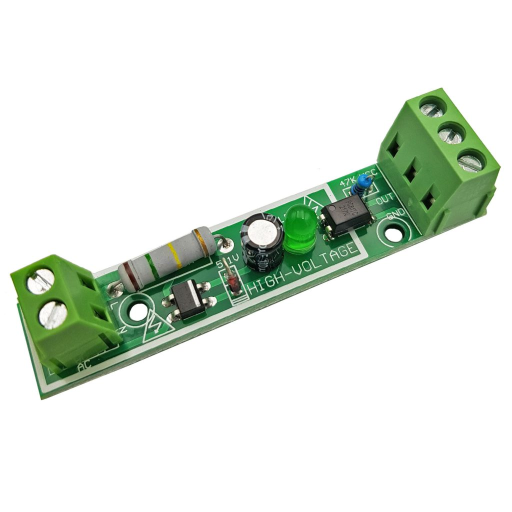
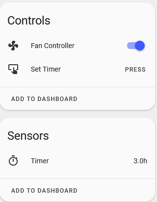
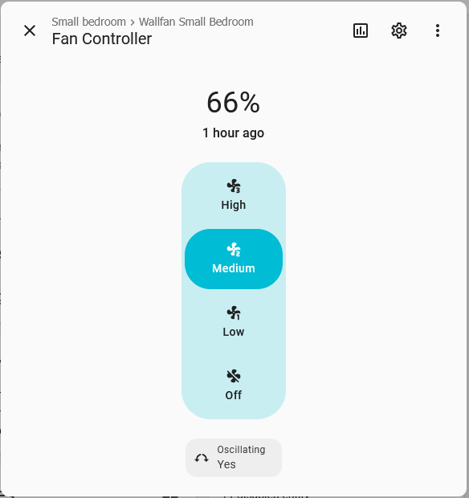

# 🌀 ESPHome Fan Component for Panasonic Fan

This is a custom ESPHome external component that implements the [fan component](https://esphome.io/components/fan/index.html) interface for Panasonic Fan with remote controller. The fan is controlled via IR interface, and the status LEDs are interfaced through a PCF8575 GPIO expander, connected to an ESP8266 via I2C.

## ✨ Features

- Compatible with Panasonic Fan
  - F409M
- Full fan control through ESPHome and Home Assistant
- Supports:
  - Power ON/OFF
  - Speed control (LOW, MEDIUM, HIGH)
  - Oscillation toggle
  - Timer (1h 3h 6h)
- Uses standard ESPHome `fan` platform
- Polls status LEDs for real-time feedback

## 🛠️ Hardware Requirements

- ESP8266 board (e.g., NodeMCU, Wemos D1 mini)
- PCF8575 I/O expander (connected via I2C)
- AC voltage sensor module (see photo below)
- Physical access to fan's controller board.
- Wiring as below diagram. 

## 🔌 Wiring Diagram

```text
ESP8266         PCF8575
---------       --------
GPIO4 (D2)  -->  SDA
GPIO5 (D1)  -->  SCL
Vin         -->  VCC
GND         -->  GND
```
```
FAN              PCF8575         ESP8266
---------        --------        -------
LED (HIGH)   -->  P02
LED (MEDIUM) -->  P03
LED (LOW)    -->  P04
LED (6H)     -->  P05
LED (3H)     -->  P06
LED (1H)     -->  P06
LED (SWING)* -->  P17
IR signal                  -->  GPIO15 (D5)
```
***NOTE**: Panasonic F409M fan doesn't have OSCILLATION LED indicator. The swing state is got by detect the AC voltage on the Swing motor.
Below AC voltage sensor module works:

```
FAN                 AC voltage sensor module        PCF8575
--------------      ------------------------        -------
AC Common wire -->   Pin N (AC side)
AC Swing wire  -->   Pin L (AC side)
                     Pin GND (DC side)          --> GND
                     Pin VCC (DC side)          --> VCC
                     Pin Out (DC side)          --> P17
```

```yaml
external_components:
  - source: components

remote_receiver:
  pin:
    number: GPIO14
    inverted: True
    mode: OUTPUT_OPEN_DRAIN
    allow_other_uses: True
  tolerance: 55%
  id: ir_receiver
  buffer_size: 2kb
  
remote_transmitter:
  carrier_duty_percent: 50%
  pin:
    number: GPIO14
    inverted: True
    mode: OUTPUT_OPEN_DRAIN
    allow_other_uses: True

i2c:
  sda: GPIO04
  scl: GPIO05
  scan: true
  id: bus_a
  frequency: 800kHz

fan:
  - platform: panafan
    model: f409m
    id: my_fan
    name: "Fan Controller"
    address: 0x20
    i2c_id: bus_a
    receiver_id: ir_receiver
```

## 🖼️ Screenshots


